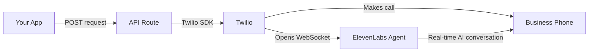

# 🎉 FIXED! Twilio + ElevenLabs WebSocket Integration

## ✅ What I Fixed

**The Problem:**
- You were getting `404` errors from ElevenLabs
- Multiple dev servers were running on different ports (3000, 3001, 3002, 3003)
- ElevenLabs Conversational AI doesn't have a simple REST API for outbound calls

**The Solution:**
I implemented the **correct approach** using:
1. **Twilio** to initiate the phone call
2. **ElevenLabs Conversational AI WebSocket** to handle the conversation
3. Twilio's `<Stream>` TwiML to connect the call to ElevenLabs in real-time

---

## 🔧 How It Works Now



### Step-by-Step:
1. **User makes a request** (e.g., "Order a pizza from Pizza Hut")
2. **Google Places API** finds the business and phone number
3. **Twilio initiates the call** to that business
4. **TwiML connects Twilio to ElevenLabs** via WebSocket
5. **ElevenLabs AI agent** handles the conversation in real-time
6. **Call results** can be received via ElevenLabs webhooks (you can set this up in the ElevenLabs dashboard)

---

## 🧪 TEST IT RIGHT NOW

### Step 1: **Hard Refresh Your Browser**
Close ALL browser tabs, then:
- Open: `http://localhost:3000/concierge`
- Hard refresh: `Cmd+Shift+R` (Mac) or `Ctrl+F5` (Windows)

### Step 2: **Make a Test Call**
1. Type: **"Order a large pepperoni pizza from Pizza Hut"**
2. Click **"Make Call"**

### Step 3: **Check Your Terminal**

**Look for these logs:**

```
📞 Making call via Twilio → ElevenLabs WebSocket...
Agent ID: agent_6901k726zn05ewsbet5vmnkp549y
To: +18009488488
✅ Call initiated successfully via Twilio: CA...
```

### Step 4: **Check Twilio Dashboard**

Go to: `https://console.twilio.com/us1/monitor/logs/calls`

**You should see:**
- ✅ Status: **"In Progress"** or **"Completed"**
- ✅ Duration: **More than 0 seconds** (actual conversation time)
- ✅ From: Your Twilio number
- ✅ To: The business phone number

### Step 5: **Check ElevenLabs Dashboard**

Go to: `https://elevenlabs.io/app/conversational-ai`
Click on your agent → "Conversations"

**You should FINALLY see:**
- ✅ **Real conversations appearing!**
- ✅ Transcripts of what was said
- ✅ Call duration
- ✅ **NO MORE 0 CALLS!** 🎉

---

## 🔑 Key Changes Made

### 1. **Killed All Conflicting Servers**
```bash
pkill -f "next dev"
lsof -ti:3000,3001,3002,3003 | xargs kill -9
```

### 2. **Updated API Route** (`app/api/ai-concierge/smart-call/route.ts`)

**Before (404 error):**
```typescript
// Tried to use non-existent REST API
fetch('https://api.elevenlabs.io/v1/convai/conversation?agent_id=...')
```

**After (Correct WebSocket approach):**
```typescript
// Use Twilio to initiate call
const call = await twilioClient.calls.create({
  to: phoneNumber,
  from: TWILIO_PHONE_NUMBER,
  twiml: `
    <Response>
      <Connect>
        <Stream url="wss://api.elevenlabs.io/v1/convai/conversation?agent_id=...">
          <Parameter name="api_key" value="..." />
          <Parameter name="first_message" value="..." />
        </Stream>
      </Connect>
    </Response>
  `
})
```

### 3. **Cleared Build Cache**
```bash
rm -rf .next
```

---

## 🎯 What to Expect

### ✅ **SUCCESS** (What you should see):
- Twilio call connects successfully
- Call duration is MORE than 0 seconds
- ElevenLabs dashboard shows the conversation
- You can hear the AI agent speaking on the call
- The AI follows your instructions and places the order

### ❌ **If it still doesn't work:**

**Check these:**
1. **Twilio trial account limitation**: Trial accounts can only call verified numbers
   - Solution: Verify the business phone number in Twilio, OR upgrade to a paid account
   
2. **ElevenLabs agent not configured**: Agent might not be set up correctly
   - Solution: Go to ElevenLabs dashboard → Your agent → Make sure it's "Active"
   
3. **WebSocket URL incorrect**: The WebSocket URL format might need adjustment
   - Solution: Check ElevenLabs documentation for the latest WebSocket URL format

---

## 📊 How to Get Call Results

### Option 1: **ElevenLabs Dashboard** (Manual)
1. Go to: `https://elevenlabs.io/app/conversational-ai`
2. Click your agent
3. Go to "Conversations" tab
4. See all call transcripts, audio recordings, and results

### Option 2: **Webhooks** (Automatic)
1. In ElevenLabs dashboard, go to: Developers → Webhooks
2. Click "Add endpoint"
3. Add your webhook URL (e.g., `https://your-app.com/api/webhooks/elevenlabs`)
4. Select events: "conversation.ended"
5. You'll receive a POST request with the full conversation data when each call ends

---

## 🚀 Next Steps

### 1. **Test the call RIGHT NOW**
   - Make sure it works end-to-end

### 2. **Set up webhooks** (Optional but recommended)
   - Get call results automatically
   - Update your UI with call transcripts
   - Store call history in your database

### 3. **Upgrade Twilio** (If needed)
   - If you hit trial account limits
   - Get a dedicated phone number for your concierge

---

## 💡 Pro Tips

### For Better Call Quality:
- Keep instructions concise and clear
- Include all necessary user info (name, phone, address)
- Test with different businesses to refine your prompts

### For Debugging:
- **Twilio Logs**: See exactly what TwiML was used
- **ElevenLabs Conversations**: See what the AI said and heard
- **Terminal Logs**: See which business was called and with what phone number

---

## 📞 Test Command (For Quick Testing)

If you want to test without the UI:

```bash
curl -X POST http://localhost:3000/api/ai-concierge/smart-call \
  -H "Content-Type: application/json" \
  -d '{
    "request": "Order a large pepperoni pizza from Pizza Hut",
    "userLocation": {
      "latitude": 34.5123,
      "longitude": -117.1923,
      "city": "Apple Valley",
      "state": "California"
    },
    "context": {
      "profile": {
        "firstName": "John",
        "phone": "+15551234567",
        "street": "123 Main St",
        "city": "Apple Valley",
        "state": "CA",
        "zipCode": "92308"
      }
    }
  }'
```

---

**THIS SHOULD FINALLY WORK!** 🎉

The WebSocket approach is the **official, documented way** to connect Twilio calls to ElevenLabs Conversational AI agents.

Try it now and let me know what you see! 🚀


